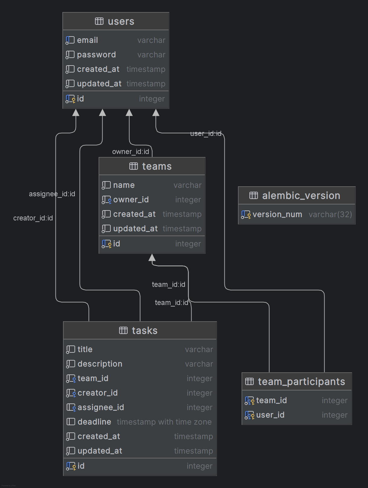

# DDD To-Do API

Это API для управления задачами, реализованное с использованием принципов **Domain-Driven Design (DDD)**. Проект
предоставляет структурированный подход для управления задачами, пользователями, командами и аутентификацией в приложении
To-Do.

## Возможности

- **Управление задачами**: Создание, обновление, удаление и получение задач.
- **Управление пользователями**: Регистрация, аутентификация и управление профилями пользователей.
- **Управление командами**: Организация пользователей в команды и управление задачами, связанными с командами.
- **Аутентификация**: Безопасная работа с защищенными эндпоинтами через механизмы аутентификации.

## Структура проекта

Проект следует модульной архитектуре, основанной на принципах DDD:

- **Core**: Общие компоненты и базовые абстракции.
- **Features**: Домены, разделённые по функционалу (`auth`, `task`, `team`, `user`), каждый из которых имеет собственные
  слои:
    - **Domain**: Сущности, объекты-значения, агрегаты и доменные сервисы.
    - **Application**: Use cases и сервисы, организующие бизнес-логику.
    - **Infrastructure**: Реализация доступа к данным, интеграция с внешними сервисами и паттерн репозитория.
    - **Presentation**: Контроллеры API, модели запросов/ответов и маршрутизация.

## Структура базы данных



## Запуск

1. **Клонируйте репозиторий**:

```bash
git clone https://github.com/ShadowP1e/DDD-to-do-API.git
cd DDD-to-do-API
```

2. **Настройте виртуальное окружение**:

```bash
python -m venv venv
source venv/bin/activate   # На Windows: venv\Scripts\activate
```

3. **Установите зависимости**:

```bash
pip install -r requirements.txt
```

4. **Настройте переменные окружения**:
    - Скопируйте файл `.env.sample` в `.env` и измените настройки по необходимости.

5. **Примените миграции базы данных**:

```bash
alembic upgrade head
```

6. **Запустите приложение**:

```bash
uvicorn --host 127.0.0.1 --port 8000 main:app
```

### Использование Docker

1. **Запустите приложение через Docker Compose**:
   ```bash
   docker-compose up -d --build
   ```

## Использование

Swagger документацию можно найти по /docs

После запуска приложения вы можете взаимодействовать с API через инструменты, такие как **Postman** или **cURL**. API
предоставляет эндпоинты для управления задачами, пользователями, командами и аутентификацией.
